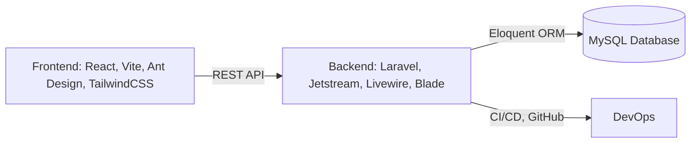

# Tổng quan dự án LavishStay Hotel Booking System

## Mục lục
1. [Giới thiệu dự án](#giới-thiệu-dự-án)
2. [Kiến trúc tổng thể](#kiến-trúc-tổng-thể)
3. [Công nghệ sử dụng](#công-nghệ-sử-dụng)
4. [Tính năng chính](#tính-năng-chính)
5. [Quy trình phát triển & lộ trình](#quy-trình-phát-triển--lộ-trình)
6. [Các bộ phận & nghiệp vụ](#các-bộ-phận--nghiệp-vụ)
7. [Thách thức & giải pháp](#thách-thức--giải-pháp)
8. [Kết quả & giá trị](#kết-quả--giá-trị)
9. [Định hướng phát triển](#định-hướng-phát-triển)

---

## 1. Giới thiệu dự án

- **Tên:** LavishStay Hotel Booking System
- **Mục tiêu:** Xây dựng hệ thống đặt phòng khách sạn hiện đại, tối ưu trải nghiệm người dùng, quản lý vận hành hiệu quả.
- **Đối tượng sử dụng:** Khách hàng, nhân viên khách sạn, quản lý, bộ phận kỹ thuật, F&B, sự kiện.
- **Giá trị cốt lõi:** Tự động hóa quy trình, tăng trải nghiệm khách hàng, giảm lỗi vận hành, dễ mở rộng.

## 2. Kiến trúc tổng thể

- **Frontend:** React, Vite, Ant Design, TailwindCSS, Redux Toolkit, React Query, Axios, Framer Motion, Vitest
- **Backend:** Laravel, Jetstream, Livewire, Blade, Eloquent ORM, RESTful API
- **Database:** MySQL, migration, seeder
- **DevOps:** Git, GitHub, Netlify/Vercel (FE), server hosting (BE)

## 3. Công nghệ sử dụng

### Frontend
- React, TypeScript, Vite, Ant Design, TailwindCSS
- Redux Toolkit, React Query, Axios, Framer Motion
- Vitest, Testing Library

### Backend
- Laravel, Jetstream, Livewire, Blade
- Eloquent ORM, RESTful API, Composer

### Database
- MySQL, migration, seeder

### DevOps & Testing
- Git, GitHub, Netlify/Vercel, server hosting
- Vitest, Testing Library

## 4. Tính năng chính

- Đặt phòng đa phòng, chọn ngày, loại phòng, xem lịch phòng
- Quản lý booking, reschedule (dời lịch), huỷ phòng, hoàn tiền
- Quản lý phòng, loại phòng, gói dịch vụ, báo cáo doanh thu
- Đăng nhập, phân quyền, bảo mật
- UI hiện đại, responsive, đa ngôn ngữ
- Quản lý khách hàng thân thiết, tích điểm, ưu đãi
- Quản lý sự kiện, hội nghị, tiệc ngoài trời
- Quản lý tài chính, hóa đơn VAT, chiết khấu OTA

## 5. Quy trình phát triển & lộ trình

### Quy trình
- Agile/Scrum: Chia sprint, daily meeting, review, retrospective
- Code review, CI/CD, tracking tiến độ, học tập cộng đồng

### Lộ trình phát triển (Roadmap)
- Nền tảng web, React core, State management, UI/UX, Routing, Advanced features, Testing & Deployment
- Milestone: Hoàn thiện MVP, kiểm thử, triển khai thực tế

## 6. Các bộ phận & nghiệp vụ

- **Khách hàng:** Tìm phòng, đặt phòng, thanh toán, check-in/out, phản ánh, đánh giá, nhận ưu đãi
- **Lễ tân:** Quản lý booking, check-in/out, xử lý yêu cầu, phản ánh
- **Quản lý khách sạn:** Quản lý phòng, giá, tiện ích, sự kiện, tài chính, nhân sự
- **Buồng phòng:** Dọn phòng, kiểm kê, báo cáo hỏng hóc
- **Kỹ thuật:** Bảo trì, xử lý sự cố
- **F&B:** Quản lý nhà hàng, bar, room service
- **Sự kiện:** Tổ chức hội nghị, tiệc, hỗ trợ đoàn khách
- **Hệ thống:** Quản lý đặt phòng, đồng bộ OTA, báo cáo doanh thu, an ninh

## 7. Thách thức & giải pháp

- Đồng bộ dữ liệu nhiều phòng, xử lý reschedule phức tạp
- Tối ưu hiệu năng, bảo mật, trải nghiệm người dùng
- Giải pháp: Refactor code, sử dụng best practice, kiểm thử tự động, chia nhỏ module

## 8. Kết quả & giá trị

- Hệ thống vận hành ổn định, dễ mở rộng
- Tăng trải nghiệm khách hàng, giảm lỗi vận hành
- Đội ngũ phát triển nâng cao kỹ năng thực chiến

## 9. Định hướng phát triển

- Tích hợp thanh toán online, AI gợi ý phòng, mobile app
- Mở rộng cho nhiều khách sạn, đa nền tảng
- Tối ưu vận hành, tự động hóa quy trình, phân tích dữ liệu

---

# Quản lý khách sạn
## Khách hàng
### Tìm phòng
- Lọc tiêu chí
  - Số lượng người
    - Số khách
  - Loại phòng
    - Deluxe Room (33m², King/Twin, View thành phố)
    - Premium Corner (42m², King/Twin, View góc)
    - The Level Premium (33m², King/Twin, The Level Lounge)
    - The Level Premium Corner (45m², King/Twin, The Level Lounge)
    - The Level Suite (93m², King, The Level Lounge)
    - Suite (93m², King, View đẹp)
    - Presidential Suite (270m², 2 King, View panorama)
- Kênh tìm kiếm
  - Website LAVISHSTA
  - Điện thoại (+84 237 8936 888)
  - Email (reservations.thanhhoa@melia.com)
### Xem phòng
- Danh sách phòng
  - Tầng thấp (2-9: Deluxe, 10-17: Premium Corner)
  - Tầng trung (18-20: The Level Premium, 21-24: The Level Premium Corner)
  - Tầng cao (25-27: The Level Suite, 28-31: Suite, 32: Presidential Suite)
- Chi tiết phòng
  - Thông tin
    - Diện tích
    - Giường
    - Tiện nghi (Cửa kính, Bồn tắm, Wifi, Minibar)
    - Giá theo mùa
      - Thấp điểm (01/01-14/05, 04/09-30/10)
      - Cao điểm (15/05-03/09, +8-15%)
      - Lễ hội (Tết, 30/4, Quốc khánh, +35-50%)
  - Đánh giá
    - (càn làm tiếp)
### Đặt phòng
- Chọn loại phòng
- Nhập thông tin
  - Họ tên
  - CCCD/Hộ chiếu
  - Giấy đăng ký kết hôn (Nếu VN + nước ngoài)
- Chọn ngày nhận/trả
- Đặt cọc
  - Phòng thường (1.000.000 VNĐ/đêm)
  - Villa (3.000.000 VNĐ/đêm)
- Chính sách hủy
  - Thấp điểm
    - Trước 7 ngày: Không phạt
    - Trước 3 ngày: 50% phí
    - Trong 3 ngày: 100% phí
  - Cao điểm
    - Trước 21 ngày: Không phạt
    - Trước 7 ngày: 50% phí
    - Trong 7 ngày: 100% phí
  - Đỉnh điểm
    - Trước 45 ngày: Không phạt
    - Trước 30 ngày: 50% phí
    - Trong 30 ngày: 100% phí
### Thanh toán
- Phương thức
  - Tiền mặt
  - VietQR
- Xác nhận
- Hóa đơn VAT (Yêu cầu thông tin công ty)
### Check-in
- Thời gian (14:00)
- Giấy tờ (CCCD/Hộ chiếu, Phiếu đăng ký lưu trú)
- Nhận phòng sớm
  - Trước 6:00: +100% giá
  - 6:00-12:00: +50% giá
- Hỗ trợ hành lý
### Lưu trú
- Dịch vụ phòng
  - Dọn phòng (Hàng ngày, Turn-down cho phòng cao cấp)
  - Room service (24/7)
  - Giặt ủi
- Tiện ích
  - Nhà hàng (Orchid, Lotus, Rumba, Alma)
  - Bar (Skyview, Panoramic, Lobby, Zenith)
  - Spa YHI (Massage, Xông hơi)
  - Hồ bơi (6:00-20:00)
  - Gym (6:00-22:00)
- Đặt trước (Spa, Nhà hàng Alma)
### Check-out
- Thời gian (12:00)
- Kiểm tra phòng (Minibar, Vật dụng)
- Thanh toán phát sinh
- Trả phòng muộn
  - 12:00-18:00: +50% giá
  - Sau 18:00: +100% giá
- Hóa đơn VAT (Gửi email hoặc trực tiếp)
### Phản ánh
- Gửi phản ánh
- Nhận giải pháp
### Đánh giá
- Gửi đánh giá
- Nhận ưu đãi (MeliaRewards, Voucher)
## Lễ tân
### Quản lý đặt phòng
- Xác nhận đặt phòng (Website, Điện thoại, Email)
- Xử lý hủy phòng
- Cập nhật trạng thái (Confirmed, Cancelled, No-show)
### Check-in
- Xác minh giấy tờ
- Cung cấp thẻ từ
- Hướng dẫn tiện ích
### Check-out
- Kiểm tra phòng
- Thu phí phát sinh
- Phát hành hóa đơn VAT
### Xử lý yêu cầu
- Đổi phòng
- Gia hạn lưu trú
- Dịch vụ đặc biệt (Khách VIP, Đoàn khách)
### Phản ánh
- Ghi nhận
- Chuyển bộ phận liên quan
- Theo dõi giải quyết
## Quản lý khách sạn
### Quản lý phòng
- Trạng thái phòng
  - Vacant
  - Occupied
  - Dirty/Out of Order
  - Out of Service
  - Due Out
  - Check Out
  - Confirmed
  - Operational
  - Completed
- Phân bổ phòng
- Kiểm kê vật dụng
  - Hàng ngày (Nước, Đồ vệ sinh)
  - Hàng tuần (Khăn, Ga giường)
  - Hàng tháng (Điện tử, Nội thất)
  - Hàng quý (Tài sản cố định)
### Quản lý giá
- Theo mùa
  - Thấp điểm (1.230.000-3.100.000 VNĐ)
  - Cao điểm (+8-15%)
  - Lễ hội (+35-50%)
- Phụ thu
  - Người lớn (670.000 VNĐ)
  - Trẻ em 6-12 (110.000-335.000 VNĐ)
  - Giường phụ (1.080.000 VNĐ)
### Quản lý tiện ích
- Nhà hàng & Bar (Orchid, Lotus, Alma, Skyview)
- Spa & Gym (YHI, 6:00-22:00)
- Hội nghị (Ballroom, 3 phòng họp, Sảnh ngoài trời)
### Quản lý sự kiện
- Hội nghị (1.000m², 900 khách)
- Tiệc ngoài trời (300 khách)
- Hỗ trợ tổ chức
### Quản lý tài chính
- Doanh thu
- Hóa đơn VAT
- Chiết khấu OTA (10-15%)
### Quản lý nhân sự
- Lễ tân (24/7, 3 ca)
- Buồng phòng (Dọn phòng, Kiểm kê)
- Kỹ thuật (Sửa chữa, Bảo trì)
- F&B (Nhà hàng, Bar)
- An ninh (24/7)
## Bộ phận buồng phòng
### Dọn phòng
- Hàng ngày (9:00-16:00)
- Turn-down (Phòng cao cấp)
### Kiểm kê
- Minibar
- Vật dụng (Khăn, Ga, Thiết bị)
### Báo cáo hỏng hóc
- Nhỏ (Xử lý trong 30 phút)
- Lớn (Gọi bảo trì ngoài)
## Bộ phận kỹ thuật
### Bảo trì
- Thiết bị điện tử
- Hệ thống khóa từ
### Xử lý sự cố
- Báo cháy
- Hỏng hóc thiết bị
## Bộ phận F&B
### Quản lý nhà hàng
- Orchid (Buffet, 260 khách)
- Lotus (A la carte)
- Rumba (Buffet sáng)
- Alma (Ẩm thực quốc tế)
### Quản lý bar
- Skyview (95 khách)
- Panoramic (36 khách VIP)
- Zenith (Cocktail cao cấp)
- Lobby Bar (28 khách)
### Room service (24/7)
## Bộ phận sự kiện
### Tổ chức hội nghị
- Ballroom (1.000m²)
- Phòng họp (3 phòng)
### Tiệc ngoài trời (300 khách)
### Hỗ trợ đoàn khách
- Check-in nhanh
- Phòng gần nhau
- Ăn uống riêng
## Hệ thống
### CiHMS
- Quản lý đặt phòng
- Đồng bộ OTA
- Báo cáo doanh thu
### Khai báo lưu trú
- Trước 23:00 (Ngày đến)
- Sau 23:00 (Trước 8:00 hôm sau)
### An ninh
- Camera
- Báo cháy
- Hộp sơ cứu
## Tình huống phát sinh
### Đổi phòng
- Phòng trống (Phụ thu nếu giá cao)
- Lỗi khách sạn (Miễn phí)
### Hỏng đồ (Bồi thường giá trị)
### No-show (Phạt 100%)
### Mất đồ (Điều tra, Bồi thường nếu lỗi)
### Khách VIP
- Check-in nhanh
- Nâng cấp phòng
- Quà chào đón
### Đoàn khách
- Check-in nhanh
- Phòng gần nhau
- Xe đưa đón
## Khách hàng thân thiết
### Cấp bậc
- Member (Miễn phí, Giảm 5% phòng, 2 đêm miễn phí)
- Gold (10-50M VNĐ, 5-25 đêm, Tích 3%)
- Platinum (50-100M VNĐ, 25-50 đêm, Tích 4%)
- Diamond (>100M VNĐ, >50 đêm, Tích 5%)
### Tích điểm
- Gold (1%)
- Platinum (1.5%)
- Diamond (2%)
### Ưu đãi
- Giảm giá phòng
- Voucher ẩm thực
- Vé VinWonders/Safari
- Spa, Golf
### Xét hạng
- Doanh thu (N + 30% N-1)
- Tự động nâng/hạ (31/12)

---
# PHÂN TÍCH CHI TIẾT BỔ SUNG (DỰA TRÊN SQL & CẤU TRÚC DỰ ÁN)
---

## 1. Tổng quan & Kiến trúc
- **Tên dự án:** LavishStay Hotel Booking System
- **Mục tiêu:** Xây dựng hệ thống đặt phòng khách sạn hiện đại, tối ưu trải nghiệm người dùng và quản lý vận hành hiệu quả.
- **Kiến trúc:** Decoupled Full-Stack
  - **Frontend (Client-Side)**
    - **Framework:** React (với TypeScript)
    - **Build Tool:** Vite
    - **Styling:** Tailwind CSS, Ant Design
    - **State Management:** Redux Toolkit, React Query
    - **API Client:** Axios
    - **Animation:** Framer Motion
    - **Testing:** Vitest, React Testing Library
  - **Backend (Server-Side)**
    - **Framework:** Laravel (PHP)
    - **API:** RESTful API
    - **Authentication:** Laravel Sanctum (for SPA)
    - **Database ORM:** Eloquent ORM
    - **Dependencies:** Composer
  - **Database**
    - **Hệ quản trị CSDL:** MySQL
    - **Quản lý Schema:** Migrations & Seeders
  - **DevOps & Tools**
    - **Version Control:** Git, GitHub
    - **Deployment:** Netlify/Vercel (FE), Hosting Server (BE)
    - **Scripts:** `auto-sync.sh`, `pull-dev.bat`, `push-dev.bat`, `start-dev.ps1`

## 2. Cấu trúc Database (Phân tích từ `datn_build_basic2 (8).sql`)
- **Core Entities (Thực thể lõi)**
  - **`hotel`**: Thông tin cơ bản của khách sạn.
    - `hotel_id`, `name`, `address`, `description`
  - **`users`**: Quản lý tài khoản người dùng và nhân viên.
    - `id`, `name`, `email`, `password`, `role_id`
    - `two_factor_secret`, `two_factor_recovery_codes`
    - `google_id`, `google_token` (Tích hợp Google Login)
  - **`roles`**: Định nghĩa các vai trò trong hệ thống.
    - `id`, `name` (admin, manager, receptionist, guest, etc.)
  - **`permissions`**: Định nghĩa các quyền hạn chi tiết.
    - `id`, `name`, `parent_id` (hệ thống quyền có phân cấp)
  - **`role_user` & `permission_role`**: Bảng trung gian phân quyền.

- **Room Management (Quản lý phòng)**
  - **`floors`**: Quản lý thông tin các tầng.
    - `floor_id`, `floor_number`, `floor_name`, `floor_type`
  - **`room_types`**: Các loại phòng.
    - `room_type_id`, `name`, `description`, `base_price_vnd`, `max_adults`, `max_children`
  - **`room`**: Các phòng cụ thể.
    - `room_id`, `room_type_id`, `name` (số phòng), `floor_id`, `status` (`available`, `out_of_service`)
  - **`amenities`**: Các tiện nghi.
    - `amenity_id`, `name`, `icon`, `category`
  - **`room_amenities`**: Tiện nghi của từng loại phòng.
  - **`bed_types`**: Các loại giường (King, Twin).
  - **`room_bed_types`**: Loại giường có sẵn cho từng loại phòng.
  - **`room_images`**: Thư viện ảnh cho các loại phòng.

- **Booking & Operations (Đặt phòng & Vận hành)**
  - **`booking`**: Bảng trung tâm lưu trữ thông tin đặt phòng.
    - `booking_id`, `booking_code`, `user_id`, `check_in_date`, `check_out_date`
    - `total_price_vnd`, `guest_count`, `children`, `children_age` (JSON)
    - `status`: `Pending`, `Confirmed`, `Operational`, `Completed`, `Cancelled`...
    - `guest_name`, `guest_email`, `guest_phone`
  - **`booking_rooms`**: Chi tiết các phòng trong một booking.
    - `booking_id`, `room_id`, `option_id`, `price_per_night`, `nights`
  - **`representatives`**: Thông tin người đại diện cho mỗi phòng trong booking.
  - **`booking_room_children`**: Lưu tuổi của trẻ em cho từng phòng.
  - **`reviews`**: Đánh giá của khách hàng sau khi ở.
    - `review_id`, `booking_id`, `rating`, `comment`, `status` (`pending`, `approved`)
    - `score_cleanliness`, `score_location`, `score_service`...
  - **`audit_logs`**: Ghi lại các hành động quan trọng (VD: chuyển phòng).

- **Pricing & Policies (Giá & Chính sách)**
  - **`seasonal_prices`**: Giá theo mùa cho từng loại phòng.
  - **`flexible_pricing_rules`**: Quy tắc giá linh động.
    - `rule_type`: `weekend`, `event`, `holiday`, `season`
    - `price_adjustment` (%)
  - **`dynamic_pricing_rules`**: Quy tắc giá dựa trên công suất phòng.
    - `occupancy_threshold` (%), `price_adjustment` (%)
  - **`holidays` & `events`**: Định nghĩa các ngày lễ, sự kiện đặc biệt.
  - **`cancellation_policies`**: Chính sách hủy phòng.
    - `free_cancellation_days`, `penalty_percentage`, `penalty_fixed_amount_vnd`
  - **`deposit_policies`**: Chính sách đặt cọc.
    - `deposit_percentage`, `deposit_fixed_amount_vnd`
  - **`check_in_policies` & `check_out_policies`**: Chính sách nhận/trả phòng.
  - **`reschedule_policies`**: Chính sách dời lịch.
  - **`extension_policies`**: Chính sách gia hạn.
  - **`children_surcharges`**: Phụ thu trẻ em.

- **Payment (Thanh toán)**
  - **`payment`**: Lịch sử các giao dịch thanh toán.
    - `payment_id`, `booking_id`, `amount_vnd`
    - `payment_type`: `deposit`, `full`, `vietqr`, `refund`, `additional`
    - `status`: `pending`, `completed`, `failed`
    - `transaction_id` (từ cổng thanh toán)
  - **`vnpay_payments`**: Lưu thông tin chi tiết giao dịch VNPay.

- **Customer Interaction (Tương tác khách hàng)**
  - **`conversations`**: Các cuộc hội thoại chat.
    - `user_id`, `client_token` (for guests), `status` (`open`, `active`, `closed`)
  - **`messages`**: Nội dung các tin nhắn trong hội thoại.
    - `sender_type` (`user`, `staff`, `bot`, `guest`)
  - **`faqs`**: Các câu hỏi thường gặp.
  - **`news` & `news_categories`**: Hệ thống tin tức, bài viết.
    - `slug`, `content`, `meta_title`, `meta_description` (Chuẩn SEO)
  - **`media_files`**: Quản lý tập trung các file media.

## 3. Luồng nghiệp vụ chính
- **Luồng Khách hàng (Customer Flow)**
  - **Tìm kiếm & Chọn phòng**
    - Lọc theo ngày, số lượng người, loại phòng.
    - Xem chi tiết phòng, tiện nghi, hình ảnh, giá.
    - Hệ thống hiển thị giá đã được tính toán linh động (theo mùa, cuối tuần, công suất...).
  - **Đặt phòng (Booking)**
    - Chọn nhiều phòng, nhiều loại phòng trong 1 lần đặt.
    - Nhập thông tin khách đại diện cho từng phòng.
    - Chọn các gói/dịch vụ đi kèm (nếu có).
  - **Thanh toán**
    - Tích hợp cổng thanh toán VNPay.
    - Thanh toán tại khách sạn.
    - Hệ thống tạo giao dịch trong bảng `payment` và `vnpay_payments`.
  - **Sau đặt phòng**
    - Nhận email xác nhận (xử lý qua Laravel Jobs/Queues).
    - Quản lý booking: xem chi tiết, yêu cầu hủy, dời lịch, gia hạn.
- **Luồng Quản trị (Admin/Staff Flow)**
  - **Dashboard**
    - Biểu đồ doanh thu, công suất phòng, lượt đặt phòng.
  - **Quản lý Booking**
    - Xem danh sách booking, lọc theo trạng thái.
    - Xác nhận booking, check-in, check-out cho khách.
    - Xử lý các yêu cầu:
      - **`cancellation_requests`**: Duyệt/từ chối yêu cầu hủy.
      - **`booking_reschedules`**: Xử lý dời lịch, kiểm tra phòng trống và chênh lệch giá.
      - **`booking_extensions`**: Xử lý gia hạn phòng.
  - **Quản lý Phòng**
    - Cấu hình `room_types`, `amenities`, `bed_types`.
    - Quản lý trạng thái các phòng cụ thể (`room`).
  - **Quản lý Giá**
    - Thiết lập giá cơ bản, giá theo mùa.
    - Tạo và quản lý các quy tắc giá linh động và tự động.
  - **Quản lý Người dùng**
    - Tạo, sửa, xóa tài khoản nhân viên.
    - Phân quyền chi tiết qua `roles` và `permissions`.
  - **Hệ thống Chat**
    - Nhân viên có thể trả lời tin nhắn từ khách hàng.

## 4. Điểm nhấn kỹ thuật
- **Kiến trúc tách biệt (Decoupled):** Frontend và Backend phát triển độc lập, giao tiếp qua API, dễ dàng bảo trì và nâng cấp.
- **Hệ thống giá linh động:** Tự động tính toán giá phòng dựa trên nhiều quy tắc phức tạp (mùa, lễ, cuối tuần, công suất), tối ưu hóa doanh thu.
- **Xử lý bất đồng bộ:** Sử dụng Laravel Queues (thể hiện qua bảng `failed_jobs`) để xử lý các tác vụ tốn thời gian như gửi email, thông báo mà không làm chậm trải nghiệm người dùng.
- **Cơ sở dữ liệu quan hệ chặt chẽ:** Cấu trúc bảng chi tiết, rõ ràng, có các bảng trung gian và khóa ngoại để đảm bảo toàn vẹn dữ liệu.
- **Hệ thống phân quyền đa cấp:** Cho phép tùy chỉnh quyền hạn chi tiết cho từng vai trò, đảm bảo an toàn và bảo mật.
- **Tích hợp bên thứ 3:** Tích hợp Google Login và cổng thanh toán VNPay.
- **Hỗ trợ SEO:** Cấu trúc bảng `news` và `media_files` được thiết kế để tối ưu hóa cho các công cụ tìm kiếm.
